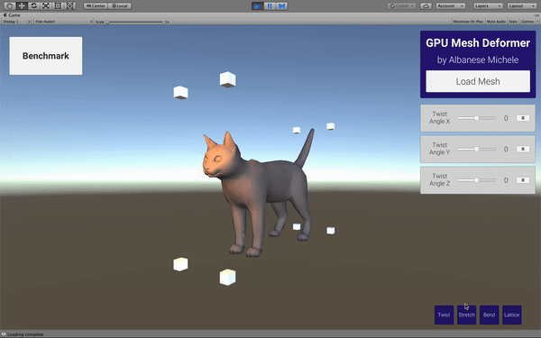

# Non-linear transformations - Shaders in Unity
This project implements non-linear transformations (**twisting**, **bending**, **free-form deformation**...) in Unity, via vertex and compute custom shaders.

## Abstract
3D models are composed of several triangles, linked together to form a complex surface in space. 

Vertices, at the end of each triangle edge, store information about position, normal direction, color and so on. Realtime mesh deformation consists in the manipulation of this data and is usually done by concatenating classical affine transformations commonly employed in computer graphics, such as rotation, scaling and translation. 

More complex effects can however be obtained by using more general transformations. These non-linear transformations, such as twisting and bending, are usually either relegated to complex CAD software or implemented in a non-efficient way on the main processor; this means they are not easily available to developers willing to integrate them in their applications. 

The aim of this work is to solve both problems, by providing a fast, simple to use and GPU-enabled framework in Unity for realtime mesh deformation. GPU deformation gives the user the possibility to easily manage meshes with far more vertices than it is possible on the CPU, since an optimized architecture is exploited to achieve the desired result. 

A demo application has also been developed to showcase the capabilities of the methods explained in this thesis. The user can enable one or more transformations described in this work by operating on a custom user-defined 3D model in a very intuitive way.
